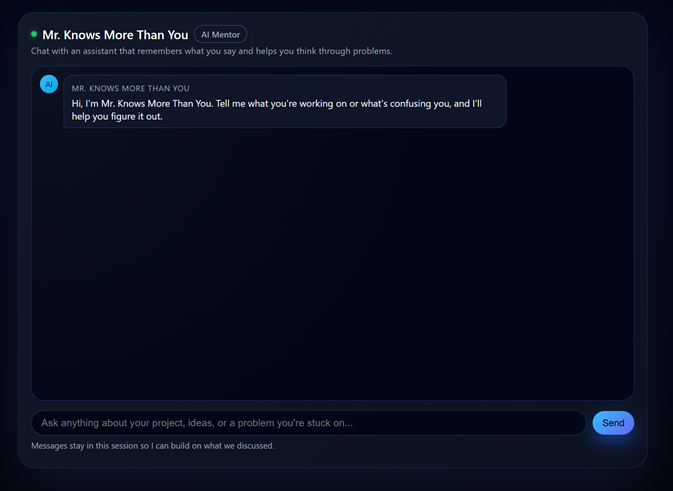

# “Mr. Knows More Than You”

An AI-powered chat application built on Cloudflare’s edge platform.

**Mr. Knows More Than You** is a playful but helpful AI mentor that:

- responds through a clean web chat interface,
- remembers the ongoing conversation (per browser tab),
- runs on a stateful Cloudflare Agent (Durable Object),
- calls a large language model (Llama 3.3) via Workers AI.

This project is built for the **Cloudflare AI optional assignment** and is designed to clearly demonstrate:

1. **LLM usage**
2. **Workflow / coordination**
3. **User input via chat**
4. **Memory / state**

---

## Demo – First Page

> Main chat interface served directly from the Worker at `/`.



*(Place a screenshot of the first page at `docs/landing.png` in the repo to see this image on GitHub.)*

---

## 1. High-Level Overview

### What the app does

- When a user opens `/`, they see a **single-page chat UI**.
- The assistant introduces itself as **“Mr. Knows More Than You”** and asks what the user is working on.
- Each message the user sends is:
  1. Sent to an **Agent** instance living in a Durable Object.
  2. Added to that session’s conversation history.
  3. Sent along with the history and a system prompt to **Llama 3.3** on Workers AI.
  4. Returned to the browser and rendered as a chat bubble.

Each browser tab gets an independent session and its own memory.

### Why it fits the assignment

- **LLM** – Llama 3.3 (`@cf/meta/llama-3.3-70b-instruct-fp8-fast`) via Workers AI.  
- **Workflow / Coordination** – All requests flow through the **Cloudflare Agents SDK** (`routeAgentRequest`) into a stateful `CfAiHelperAgent` class.  
- **User Input** – A minimal but polished **chat interface**.  
- **Memory / State** – The agent persists conversation history in Durable Object state (backed by SQLite).

---

## 2. Architecture

### Components

- **Worker / Agent Entrypoint** – `src/index.ts`
  - Exposes a `fetch` handler.
  - Serves:
    - `/` → HTML/CSS/JS chat UI (inline template).
    - `/agents/...` → forwarded into the Agent via `routeAgentRequest`.

- **Agent Class** – `CfAiHelperAgent`
  - Extends `Agent<Env, ChatState>`.
  - Holds the chat `history` array in durable state.
  - On each request:
    - Merges the new user message into history.
    - Sends `(system prompt + history)` to Llama 3.3.
    - Saves the assistant reply back into state.

- **Cloudflare Durable Object**
  - Defined via `durable_objects` and `migrations` in `wrangler.jsonc`.
  - Gives the Agent an attached SQLite database and persistent state.

- **Workers AI**
  - Configured as an `ai` binding called `AI`.
  - The model id is passed via `env.MODEL_ID`.

### Request Flow

1. **Browser → Worker**

   - The UI sends `POST /agents/cf-ai-helper-agent/:sessionId` with `{ "message": "..." }`.

2. **Worker → Agent**

   - `routeAgentRequest` finds the DO instance for `cf-ai-helper-agent/:sessionId`.
   - It instantiates or reuses `CfAiHelperAgent` and calls `onRequest`.

3. **Agent → Workers AI**

   - Agent composes the messages:
     - A **system prompt** describing “Mr. Knows More Than You”.
     - The saved `history` of user/assistant messages.
   - Calls:
     ```ts
     const result = await env.AI.run(env.MODEL_ID, { messages });
     ```

4. **Agent → Worker → Browser**

   - Agent updates its history state.
   - Returns `{ reply, historyLength }` as JSON.
   - Browser displays the assistant reply in the chat UI.

---

## 3. Memory / State Model

- Type used for state:

  ```ts
  export interface ChatState {
    history: { role: "user" | "assistant"; content: string }[];
  }

